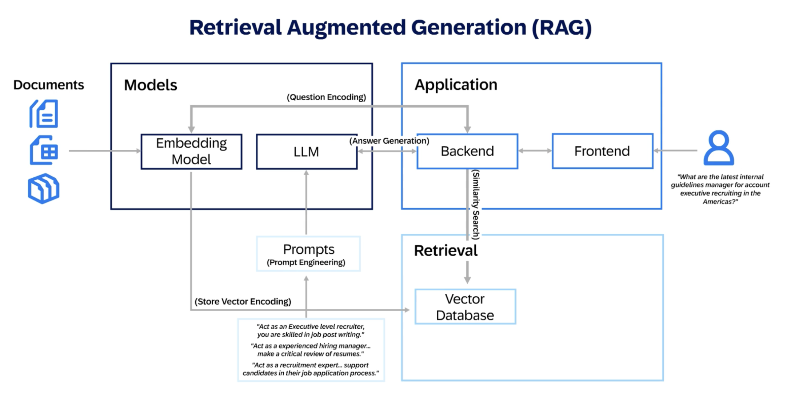
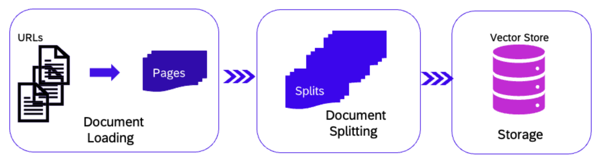

# Retrieval-Augmented Generation (RAG) with Hana Vector Engine

### Description
This module is designed to familiarize you with Retrieval-Augmented Generation (RAG) and the capabilities of the SAP HANA Vector Engine. 
By integrating these technologies, you can elevate your AI-driven solutions by combining large-scale language models with the rich data context available in SAP.

With SAP's HANA Vector Engine, you can perform vector-based similarity search and embedding-based retrieval to support more relevant, context-aware responses. 
The combination of RAG and SAP HANA enables you to retrieve relevant information from business data, which a language model then augments to generate accurate, context-specific outputs.

Using these powerful tools, you can interact with the HANA Vector Engine to create embeddings for business data, perform semantic search on large datasets, and enhance applications by integrating real-time, data-driven responses from your business context.

<br>

## Retrieval-Augmented Generation (RAG)
This section focuses on **Retrieval-Augmented Generation (RAG)**, a powerful technique for combining the strengths of retrieval and generation. RAG uses a combination of information retrieval and language models to generate responses based on retrieved content from external knowledge sources.


### Why is RAG important?
RAG provides a solution for answering complex queries by:
1. Retrieving relevant information from large collections of unstructured data.
2. Generating a coherent and context-aware reponse based on retrieval content.

**Use cases include:**
- Question answering systems
- Document sumarization
- Chatbot that need up-to-date or specific external knowledge

<br>

### RAG with HANA Vector Engine



<br>

This code performs the document split (loaded using PyPDF Loader available with Langchain) in chunks of size 200 & chunk overlap 25. If you wish to use a text file, you can use TextLoader added as import below (for other file types supported, refer - https://python.langchain.com/docs/modules/data_connection/document_loaders/) split of the text is done and embedding model is initiated using text-embedding-3-large



<br>

### Why Split Documents and Maintain Overlaps?
In retrieval-augmented generation (RAG), splitting large documents into smaller chunks is essential for efficient retrieval and better generation. Here's why:
- **Memory Constraints**: Large documents can be too big to process all at once in memory. Splitting into smaller, manageable chunks ensures the system can handle them efficiently.
- **Improved Retrieval**: Splitting allows the retrieval engine to match relevant sections more accurately, rather than considering an entire large document.
- **Maintaining Context with Overlap**: When splitting, overlaps between chunks help preserve context. This is important because the boundary of one chunk might split a coherent idea. The overlap helps ensure that the retrieval engine doesn’t lose important information that might span two chunks.

<br>

### Chunking Strategies
We are mentioning three chunking strategies, while acknowledging there could be additional ones that may require your own research and experimentation.

1. **Fixed-Size Chunking**
  - Splits text into fixed-sized chunks based on tokens or characters.
  - Positives: Simple and easy to implement.
  - Negatives: Often breaks sentences or paragraphs, leading to incomplete context.
2. **Sliding Window Approach**
  - Moves a fixed-size window across the text, creating overlapping chunks.
  - Positives: Maintains context across chunks.
  - Negatives: Introduces redundancy, increasing computational overhead.
3. **Recursive Splitting**
  - Divides text at semantic or structural boundaries like sentences or paragraphs.
  - Positives: Preserves meaning by aligning chunks with natural breaks.
  - Negatives: Computationally intensive and requires advanced parsing techniques.

> Selecting the right chunking strategy is vital for the accuracy in output of LLM-based applications. Fixed-size chunking offers simplicity but may lose meaning. Sliding windows maintain continuity but add redundancy. Recursive splitting ensures semantic integrity but requires careful implementation.

<br><br>

### Exercise:
### Step 1: Explore Chunking with Overlaps

Let's experiment with chunking and overlaps. Adjust the `chunk_size` and `chunk_overlap` values in the code below and observe how the number of chunks changes.

```python
from langchain.text_splitter import RecursiveCharacterTextSplitter

# Modify the chunk_size and chunk_overlap parameters
text_splitter = RecursiveCharacterTextSplitter(
    chunk_size=1500,  # You can change this value
    chunk_overlap=150  # You can change this value
)

splits = text_splitter.split_documents(docs)
len(splits)  # Output the number of chunks
```

<br>

### Step 2: Text Splitting with Overlaps
To efficiently search over documents, we need to split them into smaller, manageable chunks. **RecursiveCharacterTextSplitter** is a tool designed to split text while preserving context through overlaps.

Why is splitting important?
  1. Memory efficiency: Large documents are too big to process all at once.
  2. Better retrieval: Small chunks enable more accurate and faster retrieval.
  3. Overlaps help preserve context between chunks, preventing important information from being lost.

**Exercise**:
Try adjusting the `chunk_size` and `chunk_overlap` parameters and observe how the number of chunks changes.

```python
# Split
from langchain.text_splitter import RecursiveCharacterTextSplitter
text_splitter = RecursiveCharacterTextSplitter(
    chunk_size = 1500,
    chunk_overlap = 150
)
splits = text_splitter.split_documents(docs)
len(splits)
```

<br>

### Step 3: Semantic Search and Distance Functions
Semantic search helps in retrieving documents that are semantically similar to a query, not just those with exact keyword matches. Common distance functions used in semantic search are:
1. **L2 (Euclidean) Distance**: Measures the straight-line distance between two points (vectors). It's commonly used in geometric contexts but may not capture similarity well in high-dimensional spaces. When to use: • Image search and spatial data: L2 distance is often used when the data represents physical space or continuous attributes, such as in image search or geographical location data. In these cases, the exact “distance” between two points in the vector space is meaningful.
2. **Cosine Similarity**: Measures the cosine of the angle between two vectors. This is often used in text retrieval tasks because it focuses on the direction rather than the magnitude of the vectors. When to use: • Text-based retrieval: Cosine similarity works well in natural language processing tasks, where the direction of the vector (representing the semantics of the text) matters more than its magnitude. • Document clustering: When clustering text documents or searching for documents with similar topics, cosine similarity helps retrieve semantically related information even if the length of the documents varies.

**Other possible distance measures include**:
- **Manhattan Distance**: Based on the sum of absolute differences. It works well when comparing structured (tabular) data with features that are unrelated or only loosely related.
- **Jaccard Similarity**: Measures the intersection over union of sets of tokens. Jaccard similarity is ideal for tasks where you compare sets of elements, such as keyword sets, tags, or lists. It measures how similar two sets are based on shared elements.

**Exercise: Compare Distance Metrics**
Using the vectors below, calculate the L2 distance and cosine similarity between two text embeddings. Experiment with different metrics and see how the values change.

```python
from gen_ai_hub.proxy.native.openai import embeddings

response = embeddings.create(
    input="Non-compliance with the Global Travel Policy may lead to legal, tax or financial risk, and may even put SAP’s reputation at risk.",
    model_name="text-embedding-3-large"
)
print(response.data)
```

```python
len(response.data[0].embedding)
# Output: 3072
```


