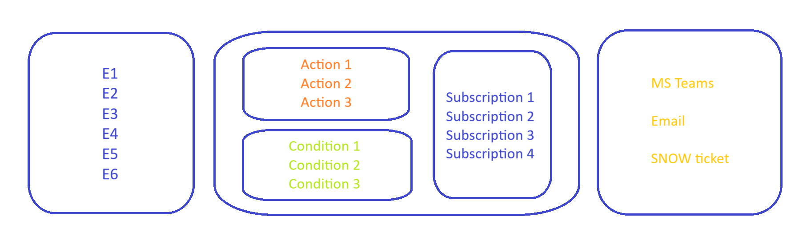

# Alert Notification Service

SAP Alert Notification service fot SAP BTP offers a common API for providers to publish alerts and for consumers to subscribe to these alerts.

- Source of Event - Iflow, CI/CD, Sub Account etc. (E1,E2,etc)
- Alert Notification Service (Action, Condition, Subscription)
- Notification Channel (MS Teams, Email, ServiceNow, etc)

